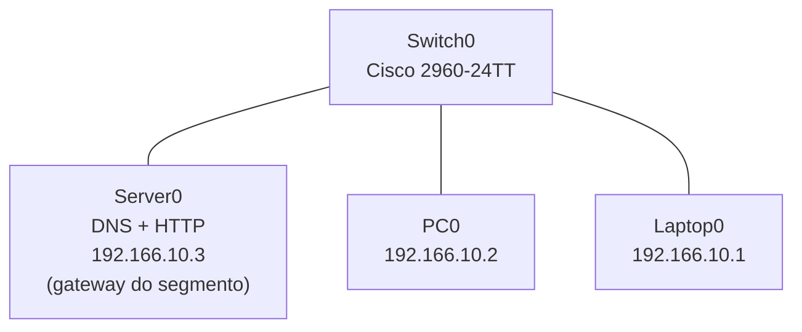

# DNS + HTTP em rede simulada — Cisco Packet Tracer

Laboratório montado no Cisco Packet Tracer para praticar o caminho completo de uma
requisição em uma rede local pequena: resolução de nomes por DNS, resolução de endereços
MAC por ARP e entrega de conteúdo por HTTP. O conteúdo publicado é o meu próprio currículo
(HTML + CSS).

---

## Topologia

Um único switch central concentra as três pontas: o servidor e as duas máquinas clientes.
Não há roteador na topologia, então todo o tráfego acontece dentro da mesma sub-rede.

---

## Endereçamento

| Dispositivo | Papel | IPv4 | Máscara |
|---|---|---|---|
| Server0 | DNS, HTTP e gateway do segmento | 192.166.10.3 | 255.255.255.0 |
| PC0 | Cliente | 192.166.10.2 | 255.255.255.0 |
| Laptop0 | Cliente | 192.166.10.1 | 255.255.255.0 |

> ⚠️ **Confira antes de publicar:** a faixa usada é `192.166.10.0/24`. Se a intenção era a
> faixa privada mais comum, `192.168.10.0/24`, é só avisar que eu ajusto o README e os
> valores. Como não existe roteador na topologia, o *gateway* configurado nas máquinas não
> chega a ser exercitado neste teste — ele só entraria em ação se existisse outra rede para
> alcançar.

---

## 1. Troca do módulo de rede do servidor por Gigabit

No Packet Tracer, trocar a interface de um dispositivo exige desligá-lo primeiro:

1. Abrir o Server0 e ir até a aba **Physical**.
2. Clicar no botão de energia do equipamento para desligá-lo.
3. Remover o módulo padrão (Fast Ethernet), arrastando-o de volta para a lista de módulos.
4. Arrastar o módulo **Gigabit Ethernet** (`PT-HOST-NM-1CGE`) para o slot vazio.
5. Ligar o equipamento novamente e conferir a nova interface em **Config** ou em
   **Desktop > IP Configuration**.

---

## 2. Serviço DNS no Server0

Na aba **Services > DNS** do Server0:

1. Ativar o serviço (**On**).
2. Adicionar um registro do tipo **A Record**:
   - Endereço: `192.166.10.3`
3. Clicar em **Add** para salvar o registro.

---

## 3. Serviço HTTP no Server0

Na aba **Services > HTTP** do Server0:

1. Ativar o serviço (**On**).
2. Substituir o conteúdo do arquivo padrão (`index.html`) pelo HTML do currículo.
3. Adicionar o arquivo de estilo (`st.css`) na mesma aba, se a versão do Packet Tracer
   permitir múltiplos arquivos.

---

## 4. Configuração dos clientes (PC0 e Laptop0)

Em **Desktop > IP Configuration** de cada máquina:

| Campo | PC0 | Laptop0 |
|---|---|---|
| Endereço IP | 192.166.10.2 | 192.166.10.1 |
| Máscara | 255.255.255.0 | 255.255.255.0 |
| Gateway padrão | 192.166.10.3 | 192.166.10.3 |
| Servidor DNS | 192.166.10.3 | 192.166.10.3 |

---

## 5. Testes gravados na simulação

Vídeo gravado no modo **Simulation** do Packet Tracer, com o filtro de eventos limitado a
`ARP`, `DNS` e `ICMP` (Event List Filters). Sequência demonstrada:

1. **DNS** — no Command Prompt de uma das máquinas: ` 192.166.10.3 `. O primeiro
   evento do Event List mostra a consulta ao Server0 e a resposta com o endereço IP.
2. **ARP** — antes de o primeiro pacote ICMP sair, a máquina de origem resolve o endereço
   MAC do destino; esse par de eventos (`ARP request` / `ARP reply`) aparece logo antes do
   ICMP no Event List.
3. **ICMP** — a troca de `echo request` / `echo reply` entre origem e destino, confirmando
   que o conteúdo é alcançável depois que nome e endereço MAC já foram resolvidos.

---

## Aprendizados

- DNS resolve o IP do serve; ARP resolve IP para endereço MAC. São camadas diferentes, e o
  Event List do Packet Tracer deixa visível a ordem em que cada uma entra em ação antes do
  ICMP sair do lugar.
- Trocar o módulo de rede de um equipamento desligado reproduz o mesmo cuidado de uma
  janela de manutenção real: a interface só existe para o resto da rede depois de o
  equipamento voltar a ligar.
- Numa rede sem roteador, configurar um gateway nas máquinas não tem efeito observável
  enquanto todo mundo estiver na mesma sub-rede — ele só importa quando existe outra rede
  para alcançar.

---

## Próximos passos

- [ ] Adicionar um roteador à topologia, mover o servidor para outra sub-rede e validar o
      gateway de fato
- [ ] Testar o serviço em HTTPS na simulação
- [ ] Repetir o teste com um dispositivo sem fio (Access Point + laptop com placa wireless)

---

Projeto de estudo em ambiente simulado. Endereços e nomes são do laboratório e não
correspondem a nenhuma rede em produção.
